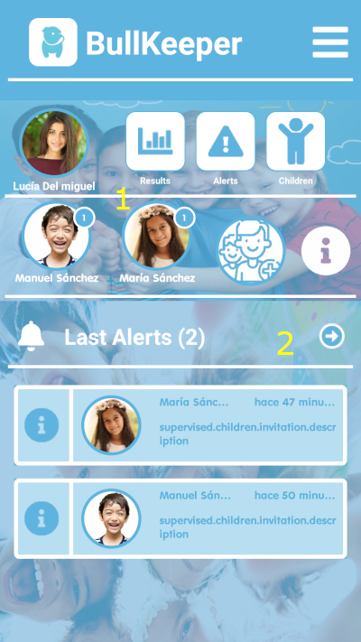
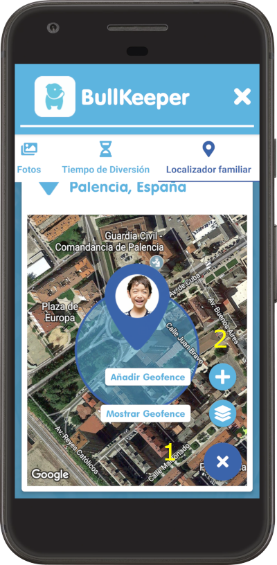
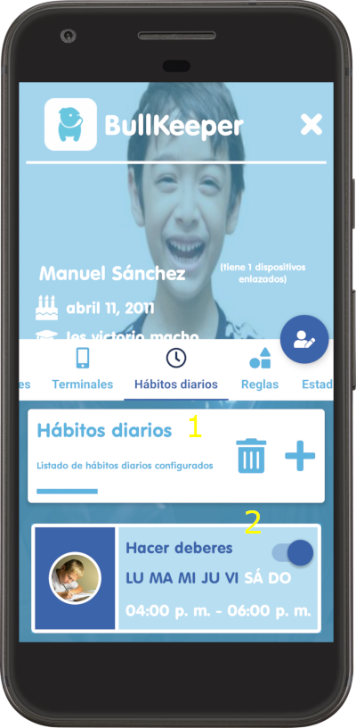
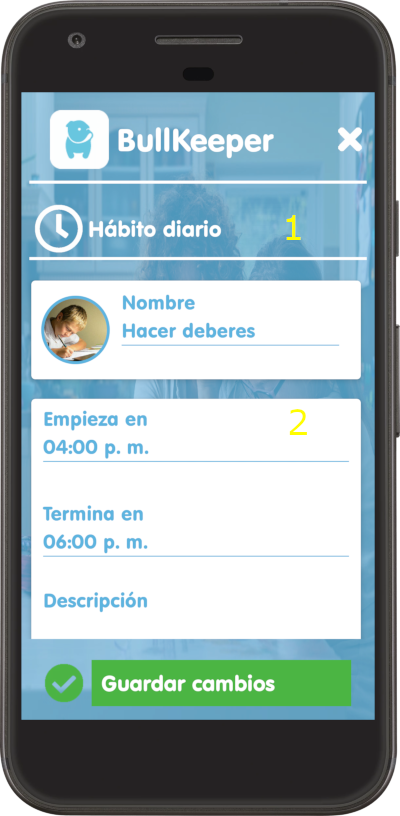
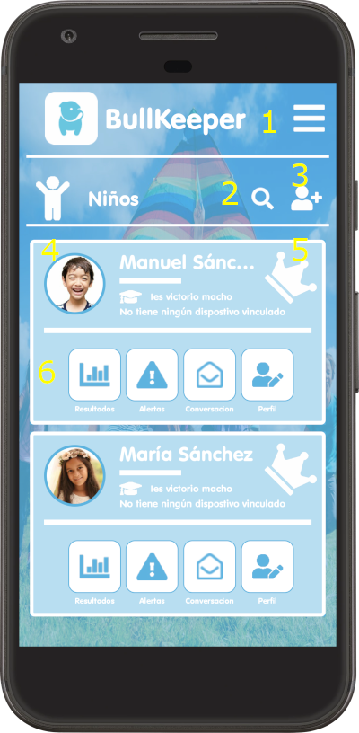
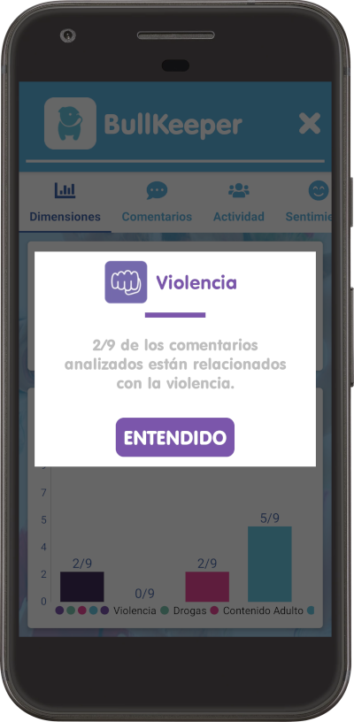
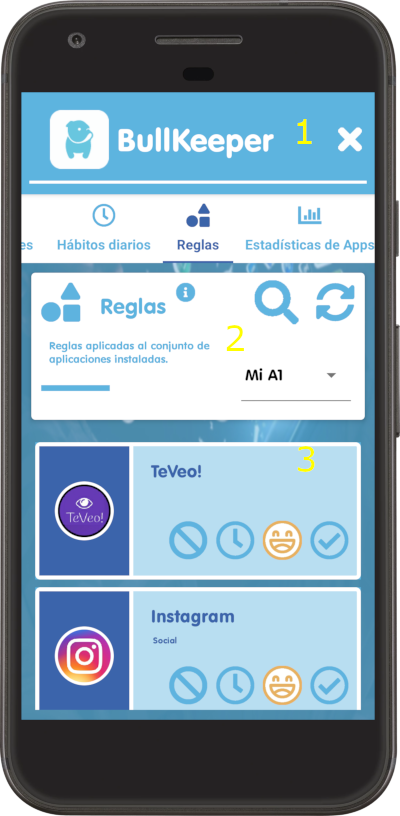

# 📱 BullKeeper Android App - Your Ultimate Digital Parenting Companion!

Discover the BullKeeper Android App - the ultimate parental control tool dedicated to empowering you in managing your children's and adolescents' digital lifestyles. 🚀

Parental control tool focused on the management of the digital lifestyle of children/adolescents whose objective is to identify potentially violent situations and create an ecosystem that facilitates early detection of various disorders derived from an inadequate or unreliable use of technology. information.

## 📱 App Description:

Welcome to BullKeeper! 🌟 I present to you a comprehensive parental control tool designed to manage your child's digital lifestyle with ease. My primary mission is to create a safe and nurturing digital environment for your children, identifying potential risks and enabling early detection of disorders that may arise from inappropriate or unreliable technology usage.

## 🚀 Key Features:

Daily Habits Control: With this app, you can effortlessly set and monitor your child's daily habits. Manage permitted applications throughout the day and during leisure time to ensure a healthy balance between screen time and other essential activities.

Family Locator: Stay worry-free by tracking your child's exact location at all times. The Family Locator feature provides real-time updates, offering peace of mind and the ability to respond promptly in case of need.

Social Media Comment Analysis: The app offer advanced tools to analyze your child's social media comments and content. Gain insights into their online interactions, helping you spot signs of violence, bullying, or emotional issues. Plus, we provide clear visualizations of the analysis results for informed decision-making.

Instant Alerts and Notifications: Receive instant alerts when inappropriate or risky activity is detected. The app keeps you in the loop, allowing you to take timely action to protect your child.

Customizable Settings: Tailor the app to your specific needs. Create personalized rules, screen time limits, and content restrictions based on each child's age and individual requirements.

Comprehensive History and Reports: Access a complete history of your child's digital activity and generate detailed reports to assess their online behavior over time.

The app empowers you as a parent or guardian, equipping you with the tools you need to guide your children toward responsible and safe technology use. Protect their emotional and physical well-being in today's ever-changing digital landscape with our market-leading parental control app.

👨‍👩‍👧‍👦 For Peace of Mind: Your child's safety and well-being are our top priorities. Join us on this journey to ensure a secure and enjoyable digital experience for your entire family.

It will allow to define daily habits, controlling the allowed applications in each moment and leisure time.

The family locator will allow to determine the exact location of the adolescent child at all times.

It allows a precise visualization of the results of the analyzes carried out for the comments extracted from each social media..

## Some Videos

### Child/adolescent registration

### Application rule settings

### Device configuration and daily habits

### Familiy Locator

## Visitors Count

## Please Share & Star the repository to keep me motivated.
  
  
