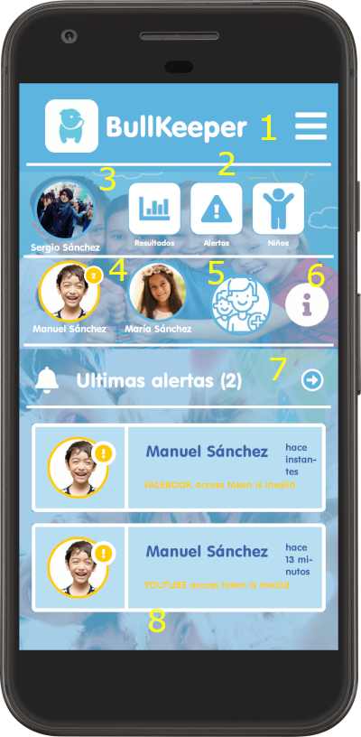

# BullKeeper Android App

Parental control tool focused on the management of the digital lifestyle of children/adolescents whose objective is to identify potentially violent situations and create an ecosystem that facilitates early detection of various disorders derived from an inadequate or unreliable use of technology. information.

It will allow to define daily habits, controlling the allowed applications in each moment and leisure time.

The family locator will allow to determine the exact location of the adolescent child at all times.

It allows a precise visualization of the results of the analyzes carried out for the comments extracted from each social media..

## Some Videos

### Child/adolescent registration

### Application rule settings

### Device configuration and daily habits

### Familiy Locator

## Visitors Count

## Please Share & Star the repository to keep me motivated.
  
  
